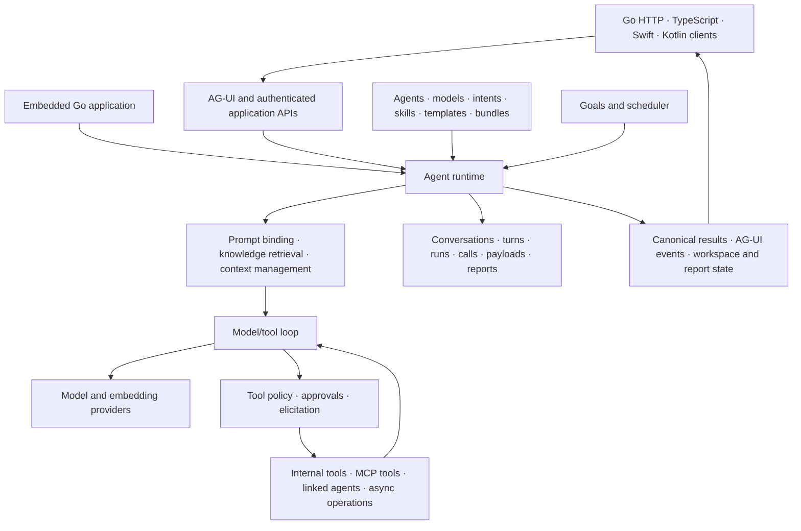

# Agently Core

[](https://pkg.go.dev/github.com/viant/agently-core)
[](LICENSE)

Agently Core is an embeddable Go framework for building agents that use tools,
work with knowledge and data, coordinate other agents, and carry work across
conversations and scheduled runs. It provides the execution, policy and durable
state behind an agentic application.

Embed it in your service when you want to own the application and integrations.
Use [Agently](https://github.com/viant/agently) for the assembled server, CLI,
web application and native mobile shells, with [Forge](https://github.com/viant/forge)
for metadata-driven interfaces.

## What Core brings to an agentic application

- **Configurable agent behavior.** Compose model selection, prompts, intent
  profiles, knowledge, skills, templates and tool bundles through a workspace.
  Intake and prompt binding prepare the task for an iterative model/tool loop.
- **Tools under a shared policy.** Dispatch internal services and MCP tools,
  govern access, request approvals and collect missing inputs through
  elicitation. Connect external systems without baking their APIs into the
  orchestration loop.
- **Durable work.** Store conversations, turns, messages, calls and execution
  state. Coordinate queued turns, cancellation, continuation and recovery;
  keep observer lifetimes separate from running work.
- **Agent coordination and autonomous execution.** Run linked agents and
  long-running operations, track conversation goals and budgets, and schedule
  work through controller-owned turns and distributed scheduler leases.
- **Interactive results.** Produce canonical transcripts, live tool feeds,
  hosted workspaces and reports with authored layouts, data sources and visual
  content. Clients consume these results through AG-UI and application APIs.
- **Extensible boundaries.** Supply providers, resource finders, tools,
  integrations and application handlers. Use the Go runtime directly or build
  web, mobile and CLI clients with the Go, TypeScript, Swift and Kotlin SDKs.

## Architecture



The authenticated runtime resolves the task's agent and configuration, creates
its durable turn, builds model context and executes the model/tool loop.
Tool results become observations for subsequent model calls; approvals and
elicitation can suspend work until the required decision or input arrives.
Async operations and linked agents retain their invocation relationships.

Execution state and presentation are connected through persisted identities.
AG-UI carries conversation runs, messages, tool activity, state and interrupts;
Agently extensions carry workspace content, goals, approvals and queued-turn
controls. Supporting BFF APIs expose history, resources and application state.
Clients can reattach to admitted work while the runtime owns execution and
recovery. See the [architecture guide](doc/architecture.md) for the lifecycle
and subsystem boundaries.

## Capabilities and guides

| Area | Capabilities | Deep dive |
| --- | --- | --- |
| Agent orchestration | Intake, agent/model selection, prompt binding, iterative execution, parallel tools and follow-up chains | [Orchestration](doc/agent-orchestration.md), [planning/intake](doc/planning-and-intake.md), [chains](doc/followup-chains.md) |
| Declarative behavior | Workspace resources, intent profiles, instructions, skills, templates and scoped YAML imports | [Workspace](doc/workspace-system.md), [profiles](doc/prompts.md), [skills](doc/skills.md), [templates](doc/templates.md), [binding](doc/prompt-binding.md) |
| Models and knowledge | Provider abstraction, embeddings, knowledge retrieval and budgeted augmentation | [Providers](doc/llm-providers.md), [embeddings](doc/embedius-embeddings.md), [augmentation](doc/augmentation.md) |
| Tools and interoperability | Registry, bundles, internal services, MCP clients/resources and optional MCP/A2A exposure | [Tools](doc/tool-system.md), [internal services](doc/internal-tools.md), [MCP](doc/mcp-integration.md), [A2A](doc/a2a-protocol.md) |
| Human interaction | Typed elicitation, forms, schema overlays, lookup inputs and governed approval | [Elicitation](doc/elicitation-system.md), [overlays](doc/overlays.md), [lookups](doc/lookups.md), [approval](doc/approval.md) |
| Conversations and context | Durable history, queue control, continuation, recovery and model-visible context budgets | [Conversation model](doc/conversation-model.md), [context management](doc/context-management.md), [SDKs](doc/sdk.md) |
| Autonomous and background work | Goals, usage accounting, controller continuation, async start/status/cancel and scheduled execution | [Goals](doc/autonomous.md), [async](doc/async.md), [scheduler](doc/scheduler.md) |
| Resources and multimodal input | Uploaded/generated files, inspection, extraction, model presentation and optional speech transcription | [Resources](doc/resources.md), [speech](doc/speech.md) |
| Workspaces and reports | UI ownership, authored controls/layouts, feeds, MCP Apps and durable report results | [UI ownership](doc/ui-ownership-model.md), [feeds](doc/feed-system.md), [MCP UI](doc/mcp-ui.md), [report contracts](doc/datly-sdk-contract.md) |
| Security and lifecycle | Identity propagation, scoped MCP credentials, access policies and owned state cleanup | [Authentication](doc/auth-system.md), [authorization](doc/authorization-policy.md), [deletion](doc/conversation-deletion.md), [maintenance](doc/database-maintenance.md) |

Supported adapters include OpenAI, Vertex AI Gemini/Claude, Bedrock
Converse/Claude, Grok, InceptionLabs and Ollama. Actual streaming, multimodal
input and token-count capabilities depend on the selected provider/model.
Context limits and overflow recovery are configurable; optional proactive
compaction is described with its [agent settings](doc/proactive-context-compaction.md).

## Embed the runtime

Requires Go 1.25.8 or newer. Supply configured agent and model finders and the
application's authenticated caller identity. This fragment illustrates runtime
composition; see the [SDK guide](doc/sdk.md) for the surrounding setup.

```go
ctx := context.Background()
rt, err := executor.NewBuilder().
    WithAgentFinder(agentFinder).
    WithModelFinder(modelFinder).
    Build(ctx)
if err != nil {
    log.Fatal(err)
}
defer rt.Close(ctx)

backend, err := sdk.NewEmbeddedFromRuntime(rt)
if err != nil {
    log.Fatal(err)
}
out, err := backend.Query(ctx, &agentsvc.QueryInput{
    ConversationID: "conversation-id",
    UserId:         "authenticated-user-id",
    Query:          "Summarize the project documentation",
})
```

To expose clients over HTTP, create a handler from that backend and configure
its authentication for the deployment:

```go
handler, err := sdk.NewHandlerWithContext(ctx, backend)
if err != nil {
    log.Fatal(err)
}
log.Fatal(http.ListenAndServe(":8090", handler))
```

Client applications use `POST /v1/ag-ui/run` and its SSE output for conversation
interaction. SDKs share the configured authentication/networking for supporting
workspace, upload, reporting and history APIs. Refer to the [SDK guide](doc/sdk.md) for Go, TypeScript, Swift and Kotlin,
and the [operation matrix](doc/ag-ui-operation-matrix.md)
for the standard protocol and Agently extension surface.

## Workspace and persistence

The default embedded workspace is `.agently` in the working directory;
`AGENTLY_WORKSPACE` selects another root. A resource ID selects an authored
agent, model, tool bundle or other configuration object.

| Resource location | Responsibility |
| --- | --- |
| `agents/` | Agent identity, model selection, prompts, knowledge and execution settings |
| `models/`, `embedders/` | Provider/model configuration and embedding resources |
| `mcp/`, `a2a/` | MCP clients and agent-to-agent definitions |
| `tools/bundles/`, `tools/instructions/` | Tool groups, policy and instructions |
| `intents/`, `skills/`, `templates/` | Scenario profiles, reusable skills and output templates |
| `workflows/`, `feeds/`, `callbacks/` | Workflow, tool-output feed and interaction definitions |
| `oauth/` | Identity-provider resources |
| `extension/forge/` | Data sources, dialogs, lookups, models and windows for UI integration |

The runtime resolves resources through finders and repositories. Workspace YAML
supports reusable imports and scoped parameters; exact parameter substitutions
preserve types. Application code can supply custom finders, register internal
tool services, add provider adapters or integrate application handlers.
Workspace resource APIs support reading and managing authored resources.

Customize behavior by composing agent configuration, tools, knowledge, intent
profiles and templates. Customize presentation through application metadata,
window definitions, data bindings, actions and themes. Forge is an independent
data-driven UI framework used by Agently; Core owns the agent lifecycle and
application-facing contracts around rendered content. See the
[workspace guide](doc/workspace-system.md), [tool system](doc/tool-system.md),
[UI ownership](doc/ui-ownership-model.md) and [SDK guide](doc/sdk.md).

SQLite and MySQL persist conversations, execution records, goals, schedules and
reports. The runtime preserves ownership and durable operation identity across
continuation and cleanup. Scheduler API and runner deployment can be separated
with `AGENTLY_SCHEDULER_API` and `AGENTLY_SCHEDULER_RUNNER`. Configuration and
operational details live in the [authentication](doc/auth-system.md),
[scheduler](doc/scheduler.md) and [maintenance](doc/database-maintenance.md) guides.

## Development

```bash
go test ./sdk ./internal/datly/contracttest ./app/store/data
(cd sdk/ts && npm ci && npm run typecheck && npm test)
swift test --package-path sdk/ios
(cd sdk/android && ./gradlew testDebugUnitTest testReleaseUnitTest)
```

Inspect `go.mod` and SDK manifests for dependencies. Android requires JDK 17
and the Android SDK; Swift requires its platform toolchain. Live provider,
MCP and device tests require their service configuration and credentials.

The [documentation index](doc/README.md) provides the full reading path.
[LICENSE](LICENSE) · [NOTICE](NOTICE)
