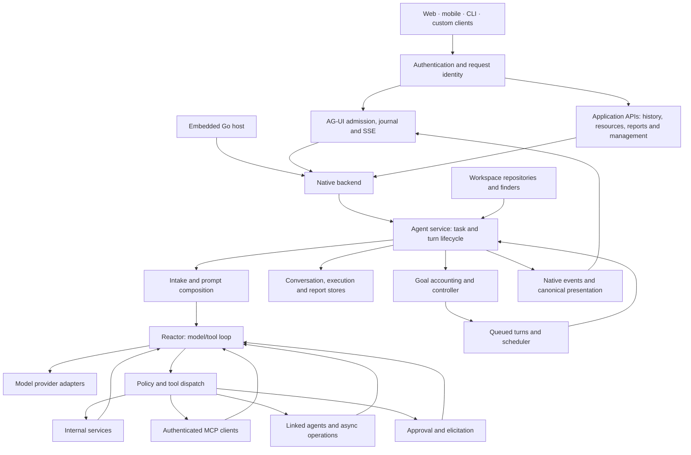

# Architecture

Agently Core owns agent execution and durable state. Applications embed that
runtime in Go or expose it to clients through AG-UI and authenticated application
APIs. The assembled Agently application supplies server configuration, CLI and
web/mobile shells; Forge supplies independent data-driven UI rendering.

## System boundaries

| Boundary | Ownership |
| --- | --- |
| SDK and HTTP | AG-UI runs/observation, authenticated application requests, typed client controls and transport state |
| Native backend and agent service | Conversation/turn identity, execution lifecycle, orchestration and recovery |
| Reactor and prompt composition | Model-visible history, instructions, knowledge, tool selection, provider invocation and iterative observations |
| Tool dispatch | Registry resolution, policy, authorization, approval and execution of internal/MCP tools |
| Durable interaction | Elicitation, approval receipts, queued work, linked invocations and async operation state |
| Goal controller and scheduler | Goal evaluation/accounting, ordinary continuation turns, scheduled wakeups and leases |
| Persistence | Conversations, messages, calls, run state, payloads, goals, schedules and report lifecycle |
| Application presentation | Canonical transcript, feed/window/report descriptors; host connectors and Forge render authored views |
| Workspace | Agent/model/tool definitions, reusable behavior resources and application configuration |

## A conversation turn

1. **Authenticate and admit.** The HTTP edge derives the caller from the
   configured session or bearer identity. AG-UI validates the request, binds its
   public thread/run identity to authorized durable state and records admission.
2. **Resolve the task.** Agent orchestration resolves workspace configuration,
   routing and intake. The runtime establishes the native conversation/turn and
   records the starter message before executing its work.
3. **Compose context.** Prompt binding combines instructions, intent context,
   skills/templates, selected knowledge and conversation history. Context
   management prepares the model-visible slice according to configured limits.
4. **Run the model/tool loop.** The provider produces text or tool calls. The
   dispatcher resolves tools through the common registry and applies policy.
   Internal services and MCP tools return observations for the next model call.
5. **Handle interaction and background work.** Approval or elicitation can wait
   for a decision/input associated with the original operation. Async tools and
   linked agents retain native invocation identities and completion state.
6. **Persist and project.** Messages, calls, results and execution state are
   persisted throughout the lifecycle. Native observations are projected into
   the ordered AG-UI journal and canonical application presentation.
7. **Finish or continue.** The runtime records the turn outcome. Goal accounting,
   follow-up chains and scheduler policy can enqueue further ordinary turns.
   Clients observe the existing run rather than owning its execution lifetime.

An embedded host calls the native backend directly. An HTTP client submits
`POST /v1/ag-ui/run` and consumes SSE events. These entry points meet at the
same execution services; there is no HTTP round trip inside native orchestration.

## Interaction and presentation

Standard AG-UI covers run/message/tool/state events and interrupt/resume
interaction. Versioned Agently extensions carry goals, approval coordination,
queue commands and application presentation. Supporting application APIs expose
native history, metadata, files and report operations under the same configured
authentication.

Navigation is application-owned; hosted windows/reports are conversation-owned;
inline content and tool feeds retain their message/turn origin. Workspace
metadata defines views, data bindings, actions, layout and appearance. The host
supplies authorized connectors and renders through Forge. Closing a view or
losing a transport connection is separate from canceling execution.

A report captures its authored document and scoped dataset requests. Its begin,
compile, completion and activation phases are distinct. Saved results can be
restored after verifying their scope and identity; export/publication is an
explicit application action.

## Workspace and extension

Finders and typed repositories resolve agent, model, embedder, MCP, tool,
intent, skill, template, workflow and UI resources. Authored YAML imports support
shared fragments and scoped parameters. Consumers load resources through these
boundaries, allowing applications to supply their own finders and integrations.

Extend behavior by registering internal tools, connecting MCP servers,
composing agent resources or adding model/provider adapters. Extend the
application by supplying handlers and metadata/data/action connectors. Runtime
code owns execution and policy; Forge owns its rendering primitives; the
application owns domain behavior and presentation choices.

## Persistence, recovery and identity

SQLite or MySQL stores the durable conversation and execution graph. Protocol
run/journal state and native execution records have distinct ownership within
that graph. Guards protect scope, revision and admitted operation identity.
Conversation cleanup follows owned references in managed transactions.

Canonical history and model-visible context serve different purposes. Context
management changes what is supplied to a model; saved messages and execution
records provide the basis for history, attribution and recovery.

Recovery reconciles persisted state, accepted receipts and native outcomes.
Reattaching to a journal is an observation operation. A disconnected client must
not assume a tool failed or repeat it merely because its response was lost.
Goals and scheduled work use the existing turn queue rather than a separate
execution engine.

## Read further

| Topic | Guides |
| --- | --- |
| Orchestration and context | [Agent loop](agent-orchestration.md), [intake](planning-and-intake.md), [prompt binding](prompt-binding.md), [context management](context-management.md) |
| Tools and knowledge | [Tools](tool-system.md), [MCP](mcp-integration.md), [augmentation](augmentation.md), [embeddings](embedius-embeddings.md) |
| Durable interaction | [Approvals](approval.md), [elicitation](elicitation-system.md), [async work](async.md), [goals](autonomous.md), [scheduler](scheduler.md) |
| Clients and presentation | [SDKs](sdk.md), [AG-UI operations](ag-ui-operation-matrix.md), [UI ownership](ui-ownership-model.md), [feeds](feed-system.md), [MCP UI](mcp-ui.md) |
| Configuration and state | [Workspace](workspace-system.md), [authentication](auth-system.md), [conversation model](conversation-model.md), [maintenance](database-maintenance.md) |

See the [documentation index](README.md) for the complete topic list.
